# 🎬 DreamBuilders - AI-Powered Testimonial Video Platform

> **Intelligent, Automated Video Testimonial Collection & Professional Reel Generation**

A full-stack web application that transforms raw video testimonials into polished, AI-enhanced marketing reels with automatic highlights, transcription, question generation, and multi-format video customization.

---

## 🌟 Key Features

### 📹 **Smart Interview System**
- **AI-Powered Question Generation**: Uses Groq's LLM (llama-3.3-70b-versatile) to generate 3-5 contextual questions based on campaign prompt
- **Multi-Language Support**: Interview questions available in English and Hindi
- **Text-to-Speech**: Questions read aloud to interviewees with natural browser voice synthesis
- **Voice Preference**: Auto-selects the most natural available system voice on each device
- **Real-Time Recording**: WebM video capture with live silence detection
- **Automatic Upload**: Seamless WebM → Backend processing pipeline
- **Host Avatar UI**: Friendly human-style avatar to guide the feedback call

### 🎯 **Intelligent Highlight Extraction**
- **AI-Powered Highlight Detection**: Groq LLM analyzes complete transcripts to identify emotional moments, problem-solution statements, and strong recommendations
- **Automatic Timestamps**: Extracts precise start/end timestamps for each highlight
- **Contextual Clipping**: 3-5 key moments automatically identified per testimonial
- **Transcript Visualization**: Full transcript display with highlight mapping
- **Manual Clip Editor**: Adjust clip start/end, reorder, remove, or add custom clips

### 🎙️ **Professional Audio Processing**
- **Automatic Transcription**: OpenAI Whisper (base model, 74MB, CPU-optimized) converts audio to text
- **Multi-Language Recognition**: Auto-detects and transcribes 99+ languages
- **Segment Preservation**: Maintains timing data for each transcribed segment
- **Speaker Emotions**: Preserves vocal nuances for authentic testimonials

### 🎞️ **Advanced Reel Generation** (Phase 3E)
- **Automatic Video Editing**: MoviePy-powered clip concatenation from highlights
- **AI-Generated Subtitles**: Whisper transcripts burned as captions with professional styling
- **Multi-Platform Aspect Ratios**:
  - 📺 **Landscape (16:9)** - YouTube, Main platforms
  - 📱 **Portrait (9:16)** - TikTok, Instagram Reels, YouTube Shorts
  - 📸 **Square (1:1)** - Instagram Feed, LinkedIn
- **Logo Watermark**: Brand watermark overlay at bottom-right
- **Background Music Mix**: Optional campaign BGM with speech-priority ducking
- **Regenerate Anytime**: Update logo, music, subtitles, or clip edits and re-render
- **Professional Styling**: White text with black stroke, perfectly centered captions

### 💾 **Campaign Management**
- **Campaign Dashboard**: Create and manage multiple testimonial campaigns
- **Customizable Prompts**: Define specific context for AI question generation
- **Progress Tracking**: Monitor interview, upload, and reel generation status

---

## 🏗️ Architecture Overview


---

## 🔄 Complete User Flow

```mermaid
sequenceDiagram
    participant User as 👤 User
    participant Frontend as 🎨 Frontend
    participant Backend as ⚙️ Backend
    participant AI as 🧠 AI Services
    participant DB as 📊 Database

    User->>Frontend: 1️⃣ Select/Create Campaign
    Frontend->>Backend: POST /campaigns
    Backend->>DB: Save Campaign
    
    User->>Frontend: 2️⃣ Start Recording Session
    Frontend->>Backend: POST /record/start
    Backend->>AI: Generate Questions (Groq)
    AI->>Backend: 3-5 Questions
    Backend->>Frontend: Questions + Audio
    Frontend->>User: 🎤 Begin Interview
    
    User->>User: 3️⃣ Answer Questions (Video)
    Frontend->>Frontend: 📹 Record WebM
    Frontend->>Frontend: 🔍 Detect Silence
    
    User->>Frontend: 4️⃣ Submit Testimonial
    Frontend->>Backend: Upload WebM Video
    Backend->>Backend: Extract Audio (FFmpeg)
    
    Backend->>AI: Transcribe (Whisper)
    AI->>Backend: Full Transcript + Segments
    Backend->>DB: Store Transcript
    
    Backend->>AI: Extract Highlights (Groq)
    AI->>Backend: Highlight Timestamps
    Backend->>DB: Store Highlights
    Backend->>Frontend: Highlights Ready
    
    User->>Frontend: 5️⃣ Review Highlights
    Frontend->>User: 📝 Display Clips + Transcript
    
    User->>Frontend: 6️⃣ Generate Reel
    Frontend->>Backend: POST /generate-reel (with options)
    Backend->>Backend: Extract Clips (MoviePy)
    Backend->>Backend: Add Subtitles (TextClip)
    Backend->>Backend: Convert Aspect Ratio (Crop)
    Backend->>Backend: Concatenate Clips
    Backend->>Backend: Encode MP4
    Backend->>DB: Save Reel Path
    
    Backend->>Frontend: Reel Ready
    Frontend->>User: ▶️ Preview Video
    
    User->>Frontend: Download Reel
    Frontend->>Backend: GET /record/reel/{id}
    Backend->>Frontend: MP4 File (FileResponse)
    Frontend->>User: 💾 Download Complete
```



---

## 💻 Tech Stack

### **Frontend**
| Technology | Version | Purpose |
|-----------|---------|---------|
| **React** | 18.2.0 | UI Framework |
| **TypeScript** | ~5.9.3 | Type Safety |
| **Vite** | 7.3.1 | Build Tool |
| **React Router** | 6.22.3 | Navigation |
| **HTML5 Media API** | Native | Video Recording |
| **Web Audio API** | Native | Silence Detection |

### **Backend**
| Technology | Version | Purpose |
|-----------|---------|---------|
| **FastAPI** | 0.109.0 | API Framework |
| **Uvicorn** | 0.27.0 | ASGI Server |
| **SQLAlchemy** | 2.0.25 | ORM |
| **SQLite** | Native | Database |
| **Pydantic** | 2.5.3 | Validation |
| **Python** | 3.x | Runtime |

### **AI & Video Processing**
| Technology | Version | Purpose |
|-----------|---------|---------|
| **Whisper** | 20231117 | Speech-to-Text (99+ languages) |
| **Groq API** | Latest | LLM (Question Generator, Highlight Extractor) |
| **MoviePy** | 1.0.3 | Video Editing (Clip, Subtitle, Aspect Ratio) |
| **FFmpeg** | External | Audio Extraction |

---

## 📊 Project Structure

```
htt_DreamBuilderss/
│
├── 📂 backend/
│   ├── config.py                 # Configuration management
│   ├── database.py              # SQLAlchemy setup
│   ├── main.py                  # FastAPI app entry
│   ├── models.py                # Database models (Campaign, Video, Highlight)
│   ├── requirements.txt          # Python dependencies
│   │
│   ├── 📂 routes/
│   │   ├── campaign.py          # Campaign CRUD endpoints
│   │   └── record.py            # Video upload, transcription, reel generation
│   │
│   ├── 📂 services/
│   │   ├── ai_questions.py      # Groq question generation
│   │   ├── ai_provider.py       # Groq API client
│   │   ├── highlight_extractor.py # Groq highlight extraction
│   │   └── reel_generator.py    # MoviePy video editing (Phase 3E)
│   │
│   ├── 📂 uploads/              # User-uploaded WebM videos
│   ├── 📂 logos/                # Campaign watermark uploads
│   ├── 📂 music/                # Campaign background music uploads
│   ├── 📂 outputs/              # Generated MP4 reels
│   └── testimonials.db          # SQLite database
│
├── 📂 frontend/
│   ├── package.json             # JavaScript dependencies
│   ├── vite.config.ts           # Vite build configuration
│   ├── tsconfig.json            # TypeScript config
│   │
│   ├── 📂 src/
│   │   ├── main.tsx             # React entry point
│   │   ├── App.tsx              # Root component
│   │   │
│   │   ├── 📂 pages/
│   │   │   ├── Home.tsx         # Campaign list & creation
│   │   │   └── CollectTestimonial.tsx # Main interview flow
│   │   │
│   │   ├── 📂 components/
│   │   │   └── Avatar.tsx       # User avatar component
│   │   │
│   │   └── 📂 services/
│   │       └── api.ts           # Backend API client (Axios-like)
│   │
│   └── public/                  # Static assets
│
└── 📂 .git/                      # Git repository
```

---

## 🚀 Setup & Installation

### **Prerequisites**
- Python 3.8+
- Node.js 16+
- FFmpeg (for audio extraction)
- Git

### **Backend Setup**

```bash
# Navigate to backend
cd backend

# Create virtual environment
python -m venv .venv
source .venv/Scripts/activate  # On Windows

# Install dependencies
pip install -r requirements.txt

# Create .env file
cp .env.example .env

# Add your Groq API key
# GROQ_API_KEY=your_key_here

# Run server
python main.py
# Server starts on http://localhost:8001
```

### **Frontend Setup**

```bash
# Navigate to frontend
cd frontend

# Install dependencies
npm install

# Start dev server
npm run dev
# Frontend accessible at http://localhost:5173

# Build for production
npm run build
```

---

## 🔌 API Endpoints

### **Campaign Routes**
```
GET    /campaigns           # List all campaigns
POST   /campaigns           # Create campaign
GET    /campaigns/{id}      # Get campaign details
```

### **Recording Routes**
```
POST   /record/upload/{campaign_id}                    # Upload video
GET    /record/transcript/{campaign_id}                # Get transcript
POST   /record/extract-highlights/{campaign_id}        # Extract highlights
GET    /record/edited-highlights/{campaign_id}         # Load edited highlights
POST   /record/edited-highlights/{campaign_id}         # Save edited highlights
POST   /record/logo/{campaign_id}                      # Upload logo watermark
GET    /record/logo/{campaign_id}                      # Fetch logo watermark
POST   /record/music/{campaign_id}                     # Upload background music
GET    /record/music/{campaign_id}                     # Fetch background music
POST   /record/generate-reel/{campaign_id}            # Generate reel with options
GET    /record/reel/{campaign_id}                      # Download reel (MP4)
```

---

## 🎯 Features by Phase

### ✅ **Phase 1: Foundation**
- Campaign management
- Video recording UI
- Backend API structure

### ✅ **Phase 2A: AI Integration**
- Whisper transcription
- Groq question generation
- Transcript display

### ✅ **Phase 2B: Highlight Extraction**
- Groq-powered highlight detection
- Timestamp extraction
- Highlight preview

### ✅ **Phase 2C: Advanced Features**
- Silence detection
- Multi-language support
- Audio synthesis

### ✅ **Phase 3A-3B: Voice Integration**
- Question text-to-speech
- Response audio processing

### ✅ **Phase 3D: Reel Generation**
- MoviePy clip extraction
- Video concatenation
- MP4 output
- Download endpoint

### ✅ **Phase 3E: Professional Customization**
- Auto-subtitle generation
- Multi-aspect ratio support (16:9, 9:16, 1:1)
- Logo watermark
- Background music with ducking controls
- Manual highlight editing and re-ordering
- Regenerate reels with updated settings
- Platform-specific optimization

---

## 🎨 User Interface

### **Home Page**
- Campaign listing with creation form
- Quick access to testimonial collection
- Campaign prompt display

### **Testimonial Collection**
- **Question Display**: Large, readable text with audio playback
- **Video Recording**: Real-time WebM capture with visual feedback
- **Highlights Review**: Transcript with highlighted sections and timestamps
- **Reel Customization**:
  - Dropdown for aspect ratio selection
  - Checkbox to toggle subtitles
  - Professional button styling
- **Video Preview**: Embedded player streaming from backend
- **Download Button**: One-click MP4 export

---

## 🔐 Environment Variables

Create `.env` file in backend directory:

```env
# Groq API Configuration
GROQ_API_KEY=your_groq_api_key_here
GROQ_MODEL=llama-3.3-70b-versatile

# Database
DATABASE_URL=sqlite:///./testimonials.db

# Server
DEBUG=false
```

---

## 📈 Performance Optimizations

| Component | Optimization | Benefit |
|-----------|--------------|---------|
| **Whisper Model** | Base (74MB) on CPU | Runs without GPU, fast inference |
| **Video Processing** | MoviePy streaming | Memory-efficient large file handling |
| **API Responses** | Typed with Pydantic | Automatic validation & serialization |
| **Frontend Build** | Vite + React Fast Refresh | <500ms dev server startup |

---

## 🐛 Known Limitations & Future Work

### Currently Supported
✅ WebM video upload (Chrome/Firefox)  
✅ Auto-transcription (99+ languages)  
✅ Highlight extraction via AI  
✅ Multi-format reel generation  
✅ Logo watermark function (backend implemented)

### Planned Enhancements
- [ ] Logo upload UI & management
- [ ] Advanced subtitle styling (colors, fonts, positioning)
- [ ] Background music/audio overlays
- [ ] Thumbnail generation
- [ ] Analytics dashboard (views, engagement)
- [ ] Multiple highlight clip arrangements
- [ ] Video quality presets

---

## 💡 Example Workflow

1. **Campaign Manager** creates campaign: *"Product Feedback - Customer Success"*
2. **AI generates** 4 contextual questions about product experience
3. **Customer** answers questions, system records 3-minute testimonial
4. **Backend** transcribes and identifies 4 key moments:
   - Opening enthusiasm (0:15-0:45)
   - Problem recognition (1:20-1:50)
   - Solution impact (2:10-2:40)
   - Strong recommendation (2:50-3:00)
5. **Reel generation** creates three versions:
   - 16:9 landscape for YouTube (30sec highlight reel)
   - 9:16 portrait for TikTok with trending aspect ratio
   - 1:1 square for Instagram feed
6. **Auto-subtitles** burned in, matching Whisper transcript
7. **Customer** downloads & shares on social media

---

## 📝 License

MIT License - Feel free to use for personal and commercial projects

---

## 🤝 Contributing

Contributions welcome! Please:
1. Fork the repository
2. Create a feature branch
3. Submit a pull request

---

## 📧 Support

For issues, questions, or feature requests, please open a GitHub issue or contact the development team.

---

**Built with ❤️ for creators and businesses who want professional video testimonials without the complexity**
